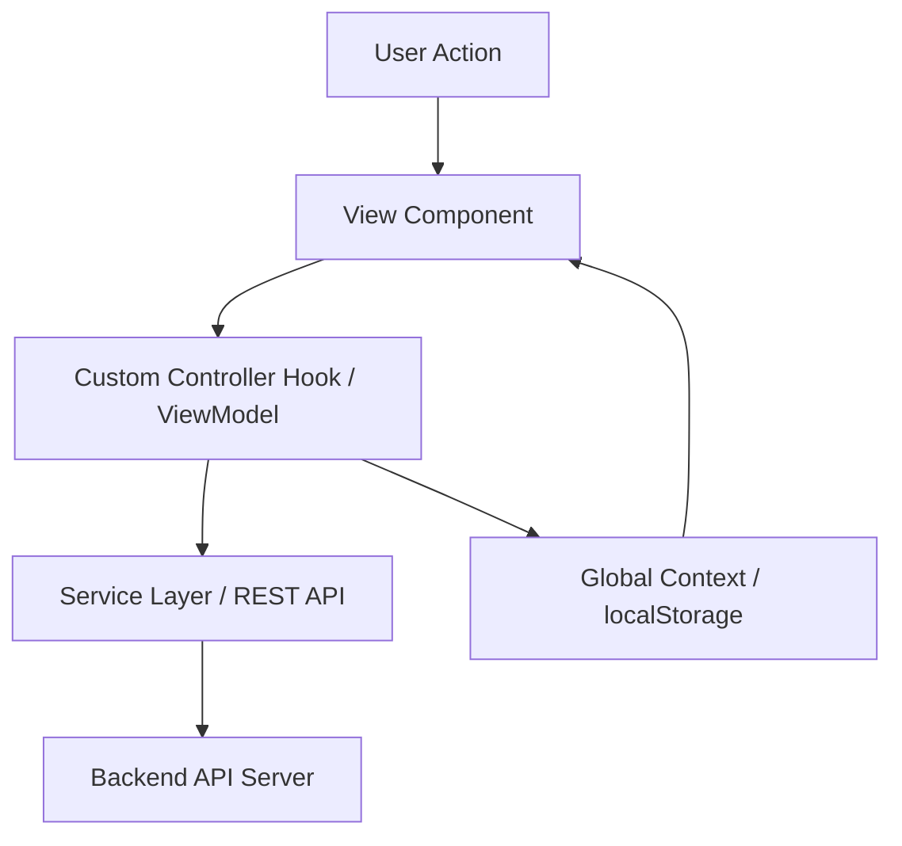
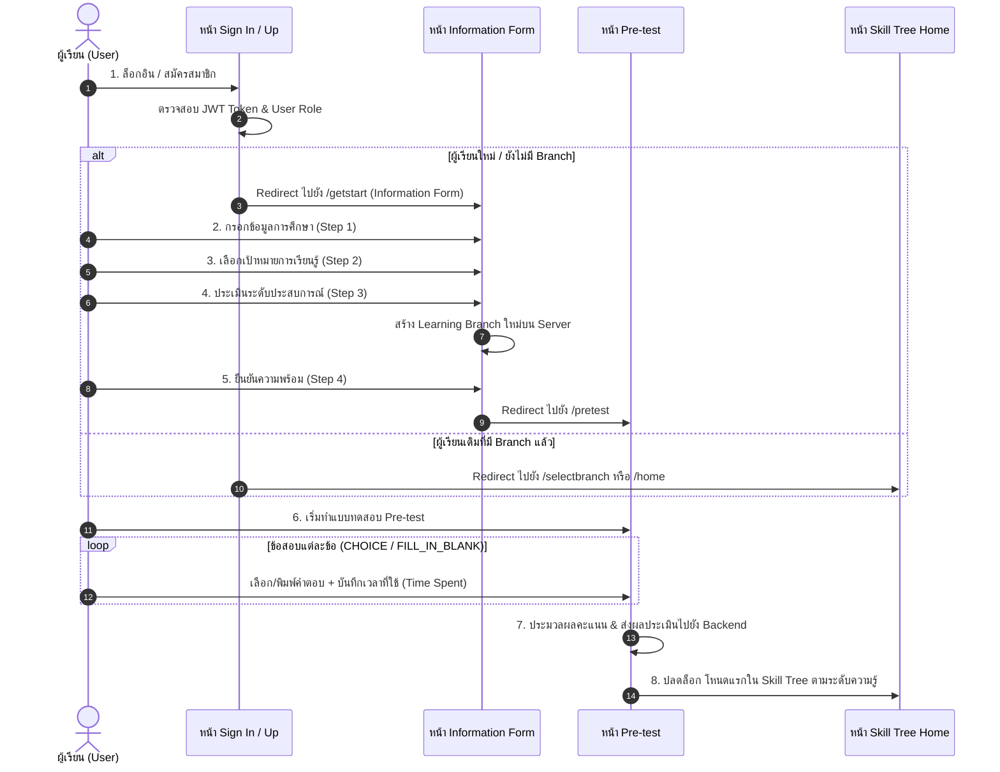
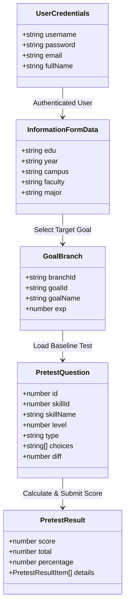

# เอกสารออกแบบระบบ (DESIGN.md)
## ระบบแนะนำเส้นทางการเรียนรู้แบบปรับเหมาะ (Adaptive Learning Platform - G06)

เอกสารนี้ระบุรายละเอียดการออกแบบเชิงโครงสร้าง UI/UX, Component Architecture, State Management, Data Flow และ API Integration ของ 3 หน้าจอหลักในกระบวนการเริ่มต้นใช้งานระบบ (User Onboarding & Baseline Assessment Flow):
1. **หน้าเข้าสู่ระบบและสมัครสมาชิก (Login & Register Page)**
2. **หน้ากรอกข้อมูลผู้เรียนและเลือกเป้าหมาย (Information / Onboarding Form Page)**
3. **หน้าแบบทดสอบก่อนเรียน (Pre-test Assessment Page)**

---

## 1. ภาพรวมสถาปัตยกรรมระบบ (System Architecture Overview)

ระบบปฏิบัติตามแนวคิด **Clean Architecture & Headless UI Pattern** โดยแยกความรับผิดชอบออกเป็น 4 ชั้นหลัก:
- **View Components (React UI)**: ทำหน้าที่แสดงผลอินเทอร์เฟซ, Styling และโครงสร้าง DOM
- **Controller Hooks (Custom React Hooks)**: จัดการ Local State, Event Handling และ Business Logic ของแต่ละหน้า
- **Service & ViewModel Layer**: สื่อสารกับ REST API (`appRestApi.ts`) จัดการแปลงรูปแบบข้อมูล (Data Transformation) และจัดการ Persistence ใน `localStorage`
- **Context Layer (`AppContext`, `ToastContext`)**: จัดการ Global Application State (เช่น Active Branch, User Profile, Notification Toast)



---

## 2. ลำดับการทำงานของผู้เรียน (User Onboarding Flow Sequence)



---

## 3. รายละเอียดการออกแบบหน้า Sign In / Sign Up (Login & Register Page)

### 3.1 แนวคิดการออกแบบ UI/UX (Design Concept)
- **Visual Design**: ให้ความรู้สึกโมเดิร์น ไฮเทค ล้ำสมัย ด้วยเอฟเฟกต์ Glassmorphism, 3D Container Glow, และพื้นหลังไดนามิก Spatter Canvas (`SpatterBackground.tsx`)
- **Theme Switching**: รองรับการสลับโทนสีสว่าง (Light ☀) และมืด (Dark ☾) แบบเรียลไทม์
- **Interactive Cursor Glow**: พื้นหลังตอบสนองต่อพิกัดเมาส์ (`pointermove`) เพื่อสร้างวงแสง Aura ติดตามเคอร์เซอร์

### 3.2 โครงสร้างส่วนประกอบ (Component Architecture)
- **`SignInAndUp.tsx`** (Parent Container): จัดการ State รวมของแท็บ (Login vs Register), ธีม (Dark/Light), Cursor Glow Listener และ Smart Redirection Logic
- **`loginPanel.tsx`**: ฟอร์มล็อกอิน เข้าสู่ระบบ
- **`registerPanel.tsx`**: ฟอร์มสมัครสมาชิกใหม่ พร้อม Validation การยืนยันรหัสผ่าน
- **`SpatterBackground.tsx`**: เรนเดอร์ลวดลายละอองสแปตเตอร์ด้วย HTML5 Canvas
- **`BrandMark.tsx`**: โลโก้และแบรนด์ดิ้งของแอปพลิเคชัน

### 3.3 รายละเอียดฟิลด์ข้อมูลและการตรวจสอบ (Fields & Validation)

| Panel | Field Name | Input Type | Validation Rules | Description |
| :--- | :--- | :--- | :--- | :--- |
| **Login** | `username` | Text | Required | ชื่อผู้ใช้งาน |
| **Login** | `password` | Password | Required | รหัสผ่าน (มีปุ่มซ่อน/แสดง 👁) |
| **Register** | `username` | Text | Required, Min 3 chars | ชื่อผู้ใช้งานใหม่ |
| **Register** | `email` | Email | Valid Email Format | อีเมลผู้ใช้งาน |
| **Register** | `fullName` | Text | Required | ชื่อ-นามสกุลจริง |
| **Register** | `password` | Password | Required, Min 6 chars | รหัสผ่านใหม่ |
| **Register** | `confirmPassword` | Password | Must match `password` | ยืนยันรหัสผ่าน |

### 3.4 Logic การสลับเส้นทาง (Routing Logic)
เมื่อยืนยันเข้าสู่ระบบสำเร็จ ระบบจะตรวจสอบสิทธิ์และสถานะของผู้เรียน:
1. หาก `userRole === 'admin'` ➔ นำทางไปยัง `/admin/home`
2. หากไม่มี Branch การเรียนรู้ในระบบ (`fetchedBranches.length === 0`) ➔ นำทางไปยัง `/getstart` (Information Form)
3. หากมี Branch การเรียนรู้อยู่แล้ว ➔ นำทางไปยัง `/selectbranch`

---

## 4. รายละเอียดการออกแบบหน้ากรอกข้อมูลผู้เรียน (Information / Onboarding Form)

### 4.1 แนวคิดการออกแบบ UI/UX (Design Concept)
- **Multi-step Wizard Pattern**: แบ่งการกรอกข้อมูลออกเป็น 4 ขั้นตอนสั้นๆ เพื่อลด Cognitive Load ของผู้เรียน
- **Progress Tracking**: แสดงการดำเนินหน้าด้วย Stepper Bar และเปอร์เซ็นต์ความคืบหน้า
- **Interactive Visual Feedback**: เอฟเฟกต์การสั่นของการ์ด (`shake animation`) เมื่อผู้เรียนลืมกรอกฟิลด์สำคัญ
- **Ambient Lighting Background**: ฉากหลังเป็น Grid และออร์บเรืองแสงลอยวนแบบนุ่มนวล (`orb-1`, `orb-2`)

### 4.2 โครงสร้างส่วนประกอบ (Component Architecture)
- **`InformationForm.tsx`**: Main View Container ควบคุมการแสดงผลตามขั้นตอน
- **`useInformationController.ts`**: Custom Controller Hook ควบคุม State ของ Form Data, การโหลด Goals จาก API, Validation และการสร้าง Branch
- **`ProgressStepper.tsx`**: ส่วนแสดงลำดับขั้นตอน (Step 1-4)
- **`StepGeneralInfo.tsx`**: ขั้นตอนที่ 1 - ข้อมูลการศึกษา (ระดับการศึกษา, ชั้นปี, วิทยาเขต, คณะ, สาขา)
- **`StepSelectGoal.tsx`**: ขั้นตอนที่ 2 - เลือกสายวิชาเป้าหมาย (เช่น Web Development, Data Science)
- **`StepExperience.tsx`**: ขั้นตอนที่ 3 - เลื่อน Slider ประเมินระดับประสบการณ์ตนเอง (ระดับ 1-5)
- **`StepReady.tsx`**: ขั้นตอนที่ 4 - หน้าสรุปเตรียมพร้อมเข้าสู่ Pre-test

### 4.3 รายละเอียดขั้นตอน Onboarding (Step Breakdown)

```
[ Step 1: ข้อมูลการศึกษา ] ──> [ Step 2: เลือกเป้าหมาย ] ──> [ Step 3: ประเมินประสบการณ์ ] ──> [ Step 4: พร้อมทำ Pretest ]
```

1. **Step 1: General Info (`StepGeneralInfo.tsx`)**
   - ฟอร์มเลือกข้อมูล: ระดับการศึกษา (ปริญญาตรี/โท/เอก), ชั้นปี (ปี 1 - ปี 4+), วิทยาเขต, คณะวิชา และสาขาวิชา
   - บังคับเลือกข้อมูลครบทุกฟิลด์ก่อนไปขั้นตอนถัดไป

2. **Step 2: Goal Selection (`StepSelectGoal.tsx`)**
   - โหลดรายการเป้าหมายจาก API (`InformationService.fetchGoals()`)
   - แสดงผลการ์ดเป้าหมายจัดกลุ่มตามประเภท (Single Selection Toggle)

3. **Step 3: Experience Rating (`StepExperience.tsx`)**
   - ปรับสไลเดอร์ประสบการณ์ตั้งแต่ระดับ 1 (No Experience / มือใหม่) ถึงระดับ 5 (Expert / เชี่ยวชาญ)
   - แสดงคำอธิบายระดับทักษะและคำแนะนำบทเรียนที่เหมาะสมแบบไดนามิก

4. **Step 4: Readiness Screen (`StepReady.tsx`)**
   - สรุปเส้นทางการเรียนรู้ที่ถูกสร้างขึ้น
   - ปุ่ม CTA "เริ่ม Pretest" นำทางเข้าสู่แบบทดสอบทันที

---

## 5. รายละเอียดการออกแบบหน้าแบบทดสอบก่อนเรียน (Pre-test Assessment Page)

### 5.1 แนวคิดการออกแบบ UI/UX (Design Concept)
- **Adaptive Knowledge Baseline**: ประเมินความรู้พื้นฐานเพื่อปรับแต่งความยากและจุดเริ่มต้นใน Skill Tree
- **Distraction-Free Test Interface**: หน้าจอทำข้อสอบเน้นความสะอาด อ่านง่าย สบายตา
- **Dual Question Format Support**: รองรับทั้งข้อสอบแบบปรนัย (Multiple Choice) และแบบอัตนัยเติมคำ (Fill-in-the-blank)
- **Code Highlighting Support**: รองรับการแสดงบล็อกโค้ดตัวอย่างพร้อมการเน้นไวยากรณ์ (Syntax Highlighting)

### 5.2 โครงสร้างส่วนประกอบ (Component Architecture)
- **`Pretest.tsx`**: Root View สำหรับสลับหน้าจอระหว่าง `intro` -> `quiz` -> `done`
- **`usePretestController.ts`**: Controller Hook สำหรับโหลดโจทย์คำถาม, นับเวลาทำข้อสอบ, ประมวลผลคำตอบ และตรวจข้อสอบ
- **`PretestIntro.tsx`**: หน้าเกริ่นนำ แสดงคำแนะนำ จำนวนข้อสอบ ระยะเวลาโดยประมาณ และระดับความยาก
- **`PretestQuiz.tsx`**: หน้าทำข้อสอบหลัก ประกอบด้วย:
  - Progress Bar & Question Ticks: แทร็กแสดงสถานะการตอบคำถามแต่ละข้อ
  - Question Header: ป้ายระบุข้อสอบ, Skill Tag, และระดับความยาก (Difficulty Level & Color Badge)
  - Code Block Container: กล่องแสดงตัวอย่างโค้ด
  - Interactive Choice / Fill Input: พื้นที่เลือกตัวเลือก A-F หรือพิมพ์คำตอบ
- **`PretestModal.tsx`**: Dialog เตือนเมื่อมีข้อสอบที่ยังไม่ได้ตอบก่อนส่งข้อสอบ
- **`PretestDone.tsx`**: หน้าแสดงผลการทดสอบ สรุปคะแนนเป็นเปอร์เซ็นต์ รายการวิเคราะห์รายข้อ และปุ่มปลดล็อกเข้าสู่ Skill Tree

### 5.3 รูปแบบข้อสอบและการประมวลผล (Assessment Engine Specs)

| Question Type | Data Payload Structure | User Input Interface | Evaluation Method |
| :--- | :--- | :--- | :--- |
| **CHOICE** | `choices: string[]` | Card Choice Select (A, B, C, D...) | เปรียบเทียบ Index ของคำตอบกับ `correctAnswer` |
| **FILL_IN_BLANK** | `answer: string` | Text Input Box (Auto-focus) | เปรียบเทียบ String คำตอบแบบ Case-insensitive / Trim Space |

### 5.4 การเก็บสถิติและเวลา (Analytics & Metrics)
ในการตอบข้อสอบแต่ละข้อ ระบบจะบันทึก:
- `questionStartTime`: เวลาเริ่มต้นอ่านข้อสอบ (ISO Timestamp)
- `endTime`: เวลาที่กดส่งคำตอบ
- `timeSpentSeconds`: ระยะเวลาที่ใช้คิดคำตอบในข้อนั้นๆ เพื่อนำไปวิเคราะห์พฤติกรรมการเรียนรู้แบบ Adaptive

---

## 6. สรุปความเชื่อมโยงของข้อมูลระหว่าง 3 หน้า (Data Contract & Integration Summary)



---

## 7. ระบบดีไซน์และ Palette สี (Design System Specifications)

### 7.1 โทนสีและ Palette หลัก (Color Tokens)
- **Primary Ink Blue**: `#0047ab` (Light Mode) / `#6ea8ff` (Dark Mode Accent)
- **Background Base**: `#0b0f19` (Dark Theme Base) / `#f8fafc` (Light Theme Base)
- **Accent Gold**: `#fbbf24` (Focus highlights, Secondary CTA)
- **Success Emerald**: `#34d399` / `#38b874` (Correct Answers, Success Toasts)
- **Error Rose**: `#f87171` (Validation Error, Warning Toasts)

### 7.2 Micro-Interactions & Glassmorphism Rules
- **Backdrop Blur**: `backdrop-filter: blur(16px)` สำหรับการ์ดลอยและ Modal Overlay
- **Transitions**: `transition: all 0.3s cubic-bezier(0.4, 0, 0.2, 1)` สำหรับ hover state ปุ่มและแท็บ
- **Feedback Animations**: Shake keyframes (`@keyframes shake`) สำหรับฟอร์มเออเรอร์

---

*จัดทำโดยทีมพัฒนา Adaptive Learning Platform (G06) — อัปเดตล่าสุด: สิงหาคม 2026*
